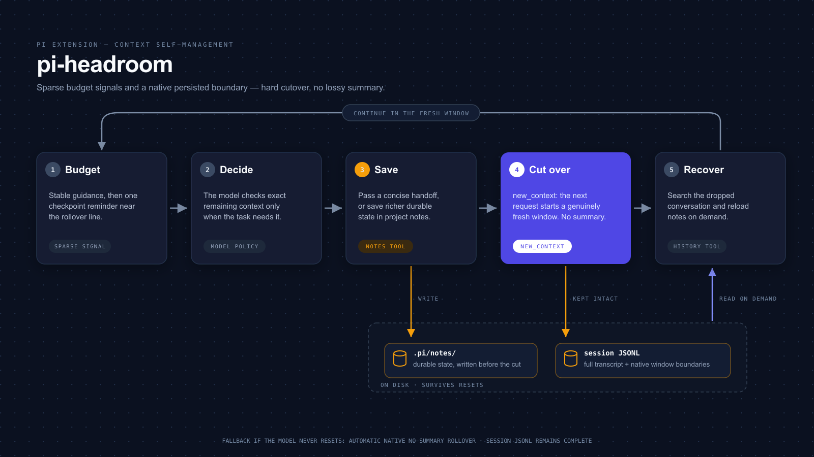

# pi-headroom

Native, model-managed context windows for a personal patched [Pi](https://github.com/earendil-works/pi): hard cutovers without lossy compaction summaries.



The model gets stable window guidance, one near-limit checkpoint reminder, and an on-demand budget tool. A rollover removes the old window from active model context while preserving the complete session transcript.

## Requirement

This version requires the [`native-context-windows`](https://github.com/fitchmultz/pi/tree/feature/native-context-windows) Pi patch. The official Pi package does not yet provide the native boundary used here.

Build the patched worktree, then launch its CLI directly with the extension:

```bash
cd /Users/mitchfultz/Projects/worktrees/pi/native-context-windows
npm run build
node packages/coding-agent/dist/bundle/cli.js \
  -e /Users/mitchfultz/Projects/worktrees/pi-headroom/native-context-windows/index.ts
```

Do not use bare `pi` for this version: that still resolves to the unchanged official global install.

## How it works

1. **Stable guidance** — window behavior is part of the system prompt. There is no changing per-request meter to distract the model or churn the prompt.
2. **Sparse reminder** — one checkpoint message appears before Pi's configured compaction reserve line.
3. **`get_context_remaining`** — returns an exact native usage reading only when the model needs it.
4. **`new_context`** — requests an atomic rollover after the complete tool batch. An optional handoff is persisted and becomes the first state in the fresh window.
5. **Automatic fallback** — Pi's automatic summary-compaction path is converted into the same no-summary rollover.
6. **`notes` and `history`** — durable project notes and normalized, window-aware transcript recovery remain available after rollover.

Pi persists a real `context_window` session entry. Session replay, usage accounting, branch navigation, compaction, and provider input all use the same authoritative boundary; the JSONL transcript remains append-only and complete.

## Tools

- `new_context({ handoff? })`
- `get_context_remaining()`
- `notes({ op, ... })`: `list`, `read`, `write`, `append`, `search`
- `history({ op, ... })`: `search`, `read`; results include native window IDs, and long reads return the next character offset

Notes live in `.pi/notes/`. Add that directory to `.gitignore` when the project should not track them.

## Develop

```bash
npm install
npm run check
```

For end-to-end testing, use the explicit patched CLI command above rather than the official installed binary.
